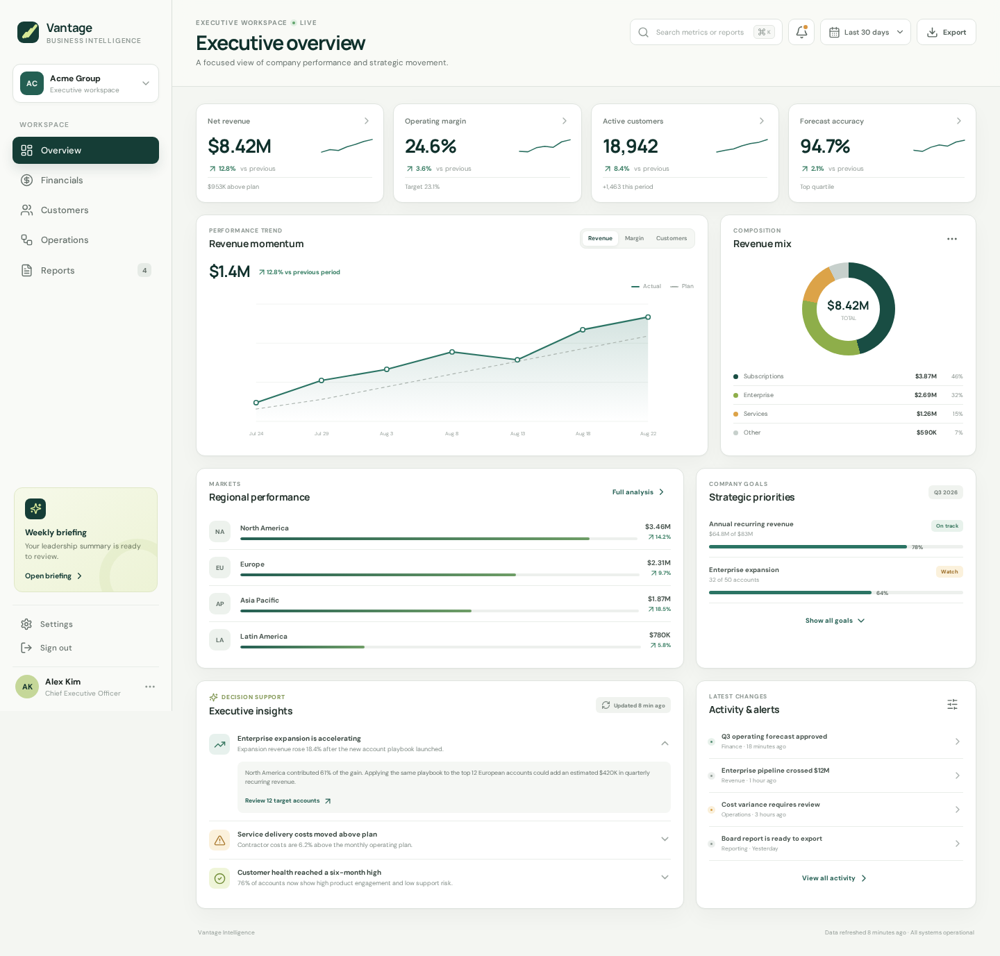
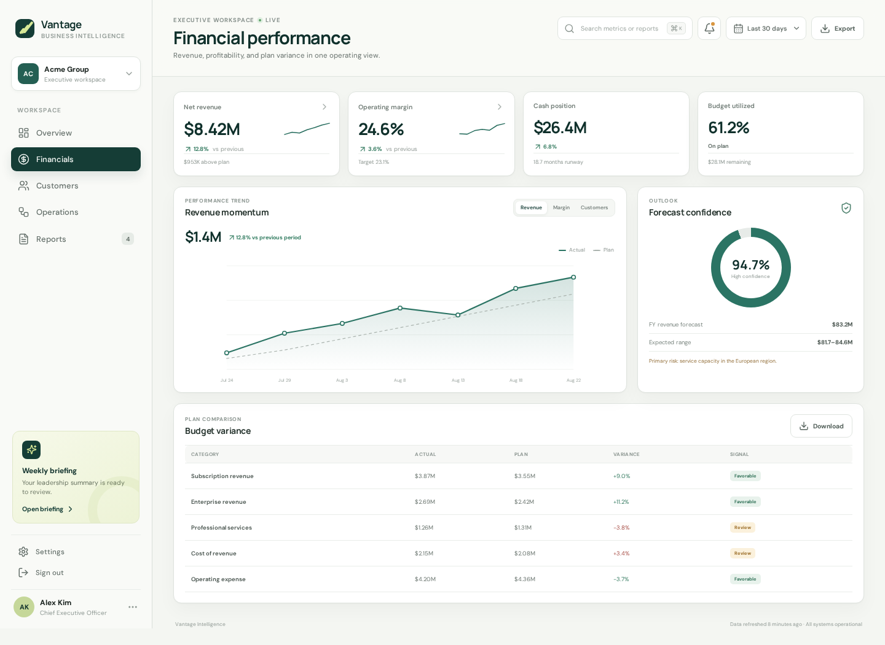
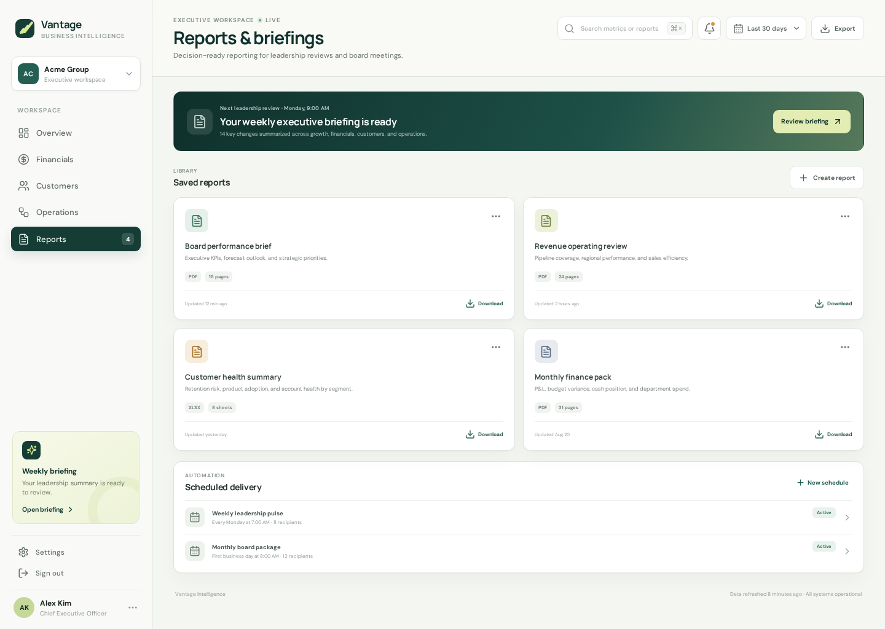
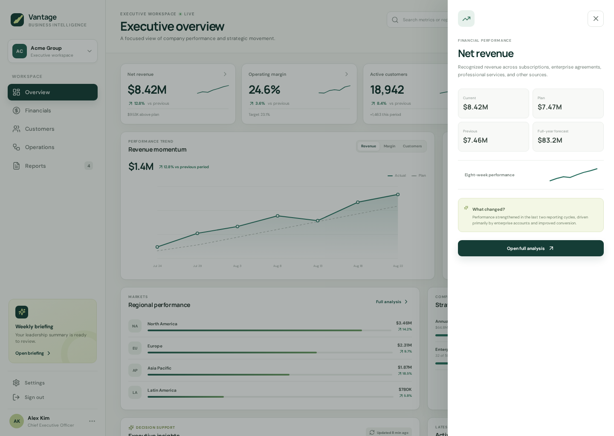
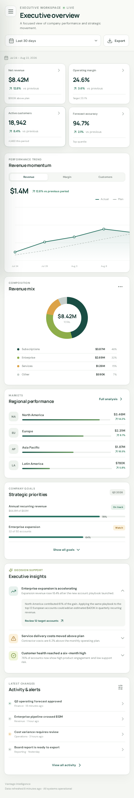

# Vantage — Executive Intelligence Platform

Vantage is a responsive SaaS analytics workspace designed to help leadership teams scan business health, identify material changes, and move from company-level signals into focused analysis.



## Product highlights

- Executive overview with revenue, margin, customer, and forecast KPIs
- Period-aware data for the last 30 days, current quarter, and year to date
- Interactive revenue, margin, and customer performance chart
- KPI drill-down drawer with comparison metrics and decision context
- Revenue composition, regional performance, and strategic goal tracking
- Progressive executive insight cards that reveal supporting analysis on demand
- Dedicated Financials, Customers, Operations, and Reports workspaces
- Responsive navigation and layouts for desktop, tablet, and mobile
- Accessible chart labels, keyboard focus states, and reduced-motion support

## Interface gallery

| Financial performance | Reports and briefings |
| --- | --- |
|  |  |

| KPI drill-down | Mobile overview |
| --- | --- |
|  |  |

## Run locally

Node.js 18 or newer is required.

```bash
npm install
npm run dev
```

Open `http://localhost:5174` in a browser.

## Validation

```bash
npm run build
npm run test:smoke
```

## Technology

- React 18
- Vite 5
- Lucide React
- Custom SVG and CSS data visualizations

## Project structure

```text
executive_insights_platform/
├── docs/screenshots/       # Repository-ready product images
├── public/                 # Web app manifest
├── scripts/                # Server-render smoke test
├── src/
│   ├── App.jsx             # Application views and interactions
│   ├── data.js             # Dashboard data model
│   ├── main.jsx            # React entry point
│   └── styles.css          # Responsive visual system
├── index.html
├── package.json
└── vite.config.js
```

## License

MIT
